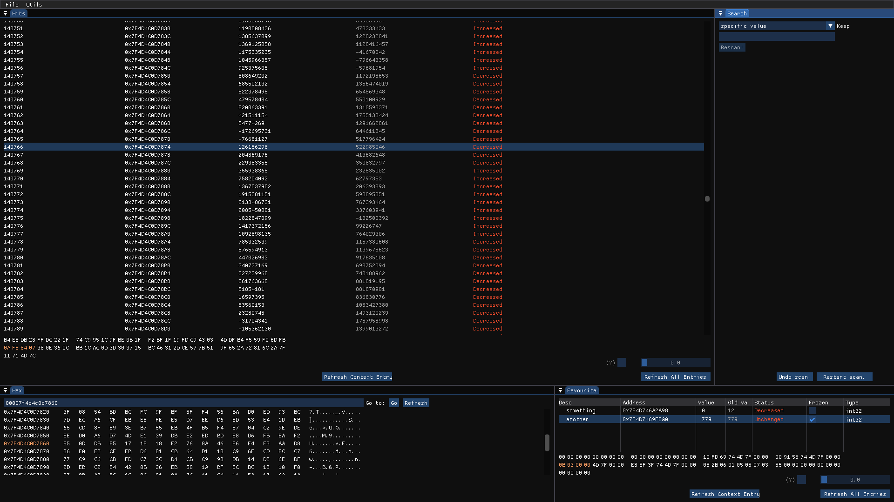

# Tenken

A memory scanner made in C++ with Dear ImGui that is cross-platform (Linux and Windows).

**Heavily work in progress and unstable as of now.**

## Main Features
- Search for values in primitive types (int8-64, float, double), in strings, or in AOB with wildcards, which returns "hits".
- Filter those hits based on relative change (higher, lower, changed, unchanged) or by certain value.
- Edit the value of said hits.
- Unknown value scanning. Takes a snapshot and marks hits based on changed or unchanged across the entire program.
- A favourite section to pin addresses of interest, plus give them descriptions; and "freeze" them at certain values.
- A hex viewer, where you can view and edit the bytes around an address in a detailed fashion (you can copy the address of a hit by right clicking, or you can copy the address of a region from Utils -> View Regions).
- A Data inspector, where you can see bytes around an address interpreted as different data types on each offset.



## Building

### Dependencies

- CMake 3.15+
- C++20 compiler
- OpenGL

GLFW is fetched automatically by CMake. Dear ImGui is included as a git submodule.

### Linux

```bash
git clone --recursive https://github.com/hangyaku-motome/Tenken
cd Tenken
./build.sh
```

### Windows (cross-compiled from Linux)

Install the MinGW-w64 cross-compiler toolchain and run:

```bash
./build.sh win
```

## Running

**Linux:** Requires you to set `cap_sys_ptrace` for the binary, root, or a relaxed `ptrace_scope` setting to read other processes' memory.

The first option is recommended:

```bash
sudo setcap cap_sys_ptrace+ep ./build-linux/Tenken
```
Now you can run without sudo.

Otherwise, `sudo ./build-linux/Tenken` to run with root. Or, `echo 0 | sudo tee /proc/sys/kernel/yama/ptrace_scope` then run normally.


**Windows:** Run as administrator.

Note: Windows Defender will probably flag the executable as malware. This happens because the program uses calls that malware may use (like `ReadProcessMemory` and `WriteProcessMemory`). You'll need to add an exception for it from Windows Defender.

## License

Tenken, program memory viewer & editor.
Copyright (C) 2026 Hangyaku

GPL-3.0-or-later. See [LICENSE](LICENSE).

## Contributing

I would highly appreciate any forms of feedback, criticism, and bug reports. You're encouraged to open an issue with that in mind.

## Author

Created and maintained by Hangyaku.

## Third-party

- [Dear ImGui](https://github.com/ocornut/imgui) — MIT
- [GLFW](https://www.glfw.org/) — Zlib
- [nlohmann/json](https://github.com/nlohmann/json) — MIT

## Other Remarks

This is a personal project, align your expectations accordingly.

Also see [TODO.md](docs/TODO.md) for goals.
